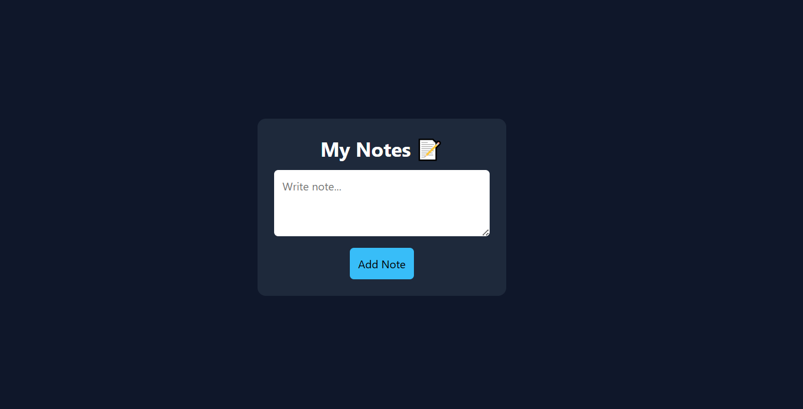

# 📝 Notes App - Day 1 Project 28

## 📌 Project Overview

This project is a modern **Notes Application** created as part of my semester challenge to build 200 websites.

It allows users to create, display, and delete notes dynamically using JavaScript.

---

## 🎯 Features

* 📝 Add New Notes
* 📋 Display Notes
* ❌ Delete Notes
* ⚡ Real-time Updates
* 🎨 Clean and Minimal UI

---

## 🛠️ Technologies Used

* HTML5
* CSS3
* JavaScript (DOM Manipulation)

---

## 📂 Project Structure

```id="k2m7z1"
site-28-notes-app/
│
├── index.html
├── style.css
├── script.js
├── preview.png
└── README.md
```

---

## 📸 Preview



---

## 💡 Learning Outcome

* Learned dynamic DOM manipulation
* Practiced event handling
* Built interactive note system
* Improved JavaScript logic skills
* Strengthened Git & GitHub workflow

---

## 🔥 Author

**Yash Patil**
Future Data Engineer 🚀

---

## ⭐ Note

This project is part of my goal to build **200 websites** to improve my web development and design skills.
